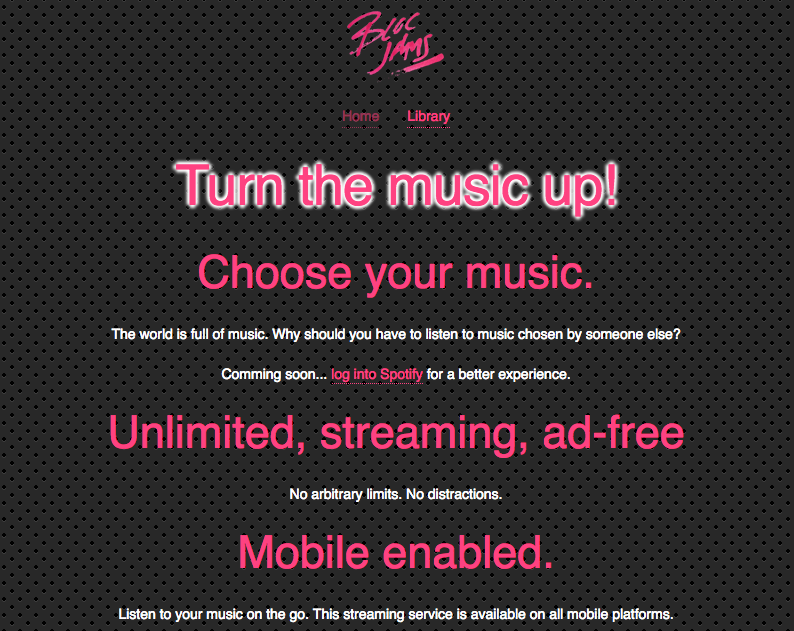
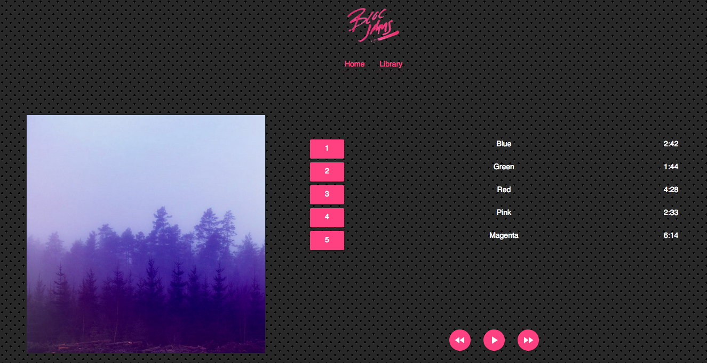

This project was built with [Create React App](https://github.com/facebookincubator/create-react-app) and is hosted by [Netlify](https://www.netlify.com).

## Introduction

Bloc Jams React is a music player with a dashboard for administrators that I built for [Bloc.io](https://bloc.io) while I was in their Web Developer track. My components are class-based and handle state as recommended in the [React documentation](https://reactjs.org/docs/getting-started.html).

## Navigation

- [Landing page](https://nydame-bloc-jams-v2.netlify.com) 
- [List of albums](https://nydame-bloc-jams-v2.netlify.com/library)
- Music player for each album ([example](https://nydame-bloc-jams-v2.netlify.com/album/the-colors)) 
- Password-protected [Dashboard](https://nydame-bloc-jams-v2.netlify.com/dashboard) showing analytics for user interactions of interest. Visitors to the site are redirected to a login page unless they are already logged in as an administrator.

## Features

- Routing implemented with [React Router](https://www.npmjs.com/package/react-router-dom)
- Music player affordances implemented through [HTML Audio](https://developer.mozilla.org/en-US/docs/Web/HTML/Element/audio) element
- Authorization (for Dashboard) implemented with React Router
- User authentication (for Dashboard) carried out by [Firebase](https://firebase.google.com)
- Data on user interaction stored on Firebase
- Dynamic charts implemented with [D3.js](https://d3js.org)
